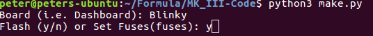

# Build Chain Design
Here I shall take some time to explain the thought process and execution behind the firmware build chain for the 2017-2018 Olin Electric Motorsports competition year. 

Author: Peter Seger &copy 2017

License: MIT

## Background
Going into this year, we had two previous year's worth of system design to inform our decision. 
During the 2015-2016 year, we used a Makefile and during the 2016-2017 season we used a CMake approach.
Our previous years' build chains had worked just fine and had fulfilled or needs, but there were some common flaws with them:

- Hard to understand
    - This limited the number of people who were able to edit it meaning it was often left unchanged and quickly became out of date
- Written in languages that most people didn't know
    - Our electrical team is comprised of a large number of first year and sophomore year sudents most of whom do not know C let alone have experience using Makefiles or editing CMake files.
- Didn't scale enough for our project
    - Our project calls for writing code for ~20 different boards. Most build chains make it quite difficult to build multiple different projects and we wanted to do it all out of directory.

## Options
After using and breaking the previous two year's worth of code, we sought to find or develop an alternative. After looking at expanding our previous tools, we decided to develop our own in Python. In essense, we would process the user interaction in Python, process their commands, and create Shell commands which the script would execute in the correct order as to make `.elf` files and `.hex` files before flashing them to boards using AVRGCC.

While definitely unordthodox, this approach afforded us some great advantages:
- Firstly, it is simple
    - Plain and simple, our build chain was a Python script. Every member on the team knows Python which means that every student can look at the code and at least have a general idea of what is going on.
- Secondly, it is easy to edit
    - Building off the first part, but team members who were more advanced in their Python or on the firmware team could modify and expand the code with relative ease. This allows us to break our chain down into the core features and extra features that would help us build better, faster, stronger.

By making our code more modular we were able to get the core functionality pretty quickly and have been able to work on adding functionality then after.

## How it works
- The user is prompted for which board they want to build and whether they want to flash it or set the fuses

