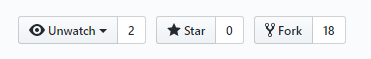
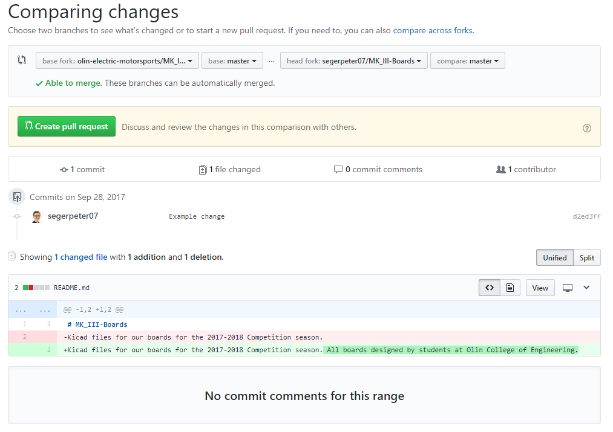

# Git Cheatsheet
Need to git and don't really know what you're doing, or just want a refresher? Look no further!
Here is the master cheat sheet for git.

### Forking
Here at OEM, we work on a forking method of git management. Basically what this means is that every member
of the team has a complete copy of the master branch which they edit and then submit pull requests to merge
code with the master. To get started, you need to fork the master repo:

Just click the fork button and git with copy all the data over into a repo of your own. This repo will be located
under your username and is all yours. 

### Cloning
Now you need to clone the repo onto your computer. Here's how you do that:
```
$ git clone https://github.com/olin-electric-motorsports/Mk_III_boards.git
```
The link you need to do this comes from the "clone or download" button on your newly made repo. Now you can go ahead and make local changes to your repo. Once you make some changes to your repo, say by writing a function or adding
a new PCB, you might want to add your code to the master branch...

### Merging / Pull Requests
Now that you have new code on your branch, you need to get it on the master branch. To do this, you need to open 
a pull request. This basically indicates to the leadership team that your code/board is ready for integration and
starts that dialog. To do so, first go to the pull requests tab in **YOUR** repo:

Next, click the "New Pull Request" Button.

Now you'll get to this pretty intense screen which I'll break down from top to bottom:

-First thing at the top is the branch comparison selection. This lets you choose which branch github will compare with master to look at changes. The defaul is usually fine, unless you are working with branches in your local repo. 
-Below that you'll get a button that says "Create Pull Request" if you can sucessfully make a PR. If you cannot merge the branch, it will display an error and explain why you cannot. Try and see if you can figure out the problem, and if you need some help, come find a member of the leadership team.
-Below that github lists all the commit messages for that specific push. Usually you will only have one commit message,
-Next is a code snippet that shows the changes that were made. Here is where the comparison selection comes into handy since this is what github uses to generate these comparisons. Red highlighted code is code that was changes or deleted, and green code is new code or code modifications.

Once everything looks good here, you can go to the "Create PUll Request" button and click away!


Now you'll get this screen where you can write a message and assign people to your PR. Write a meaningful message so that the reviewer know exactly what you changed and can understand what they are integrating with the rest of the code.
You will also need to assign reviewers on the right side so that Peter, Byron, Alex, or Lucky will get a message and know to review you PR.

You can also assign yourself so you can keep track of the status of your PR.

Please add labels if relevent and add the project that the PR came from.

Finally, you can "Create PUll Request" and we will review your PR and either merge it with master or comment on what needs to be changed.

### Pulling
Whenever you start working on your local branch, you don't necessarily know if changes have been made on the master branch that you need to have as well. To prevent this, you will **ALWAYS** pull upstream before starting working. What this does is add all the new code from the master branch to your local branch. First things first, you need to setup your remotes.

#### Setting up Remotes
```
$ git remote add origin 
```
